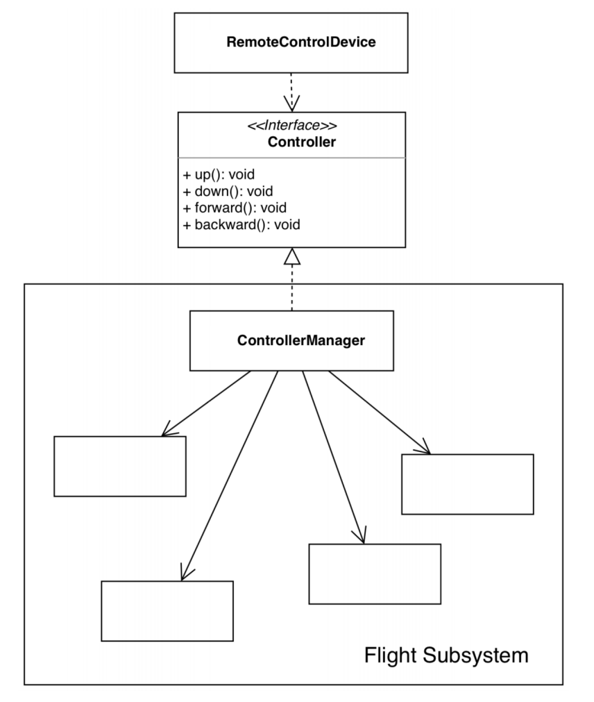

* 이제 오직 Controller를 통해서 클라이언트는 접근할 수 있게 되었다. 이는 기존의 컨트롤러들(fly, drive, sail) 보다 더 상위 수준의 인터페이스라고 할 수 있다.
* 그리고 이 것을 구현한 구현체인 ControllerManager는 "서브 시스템(시스템을 제작하는 사람이 사용할 수 있는 시스템의 일종)"이라고 부를 수 있다.
* ControllerManager에게 인터페이스의 사용법(호출법)을 위임하였고 ControllerManager는 해당 역할만 하는 단일 책임 원칙을 지켰으며, 기존의 메소드인 fly, drive, sail을 클라이언트에게 제공하는 것이 아닌, up, down, forward, backward로 제한적으로 (필요한 메소드만)제공함으로써 인터페이스 분리 원칙을 지켰다.