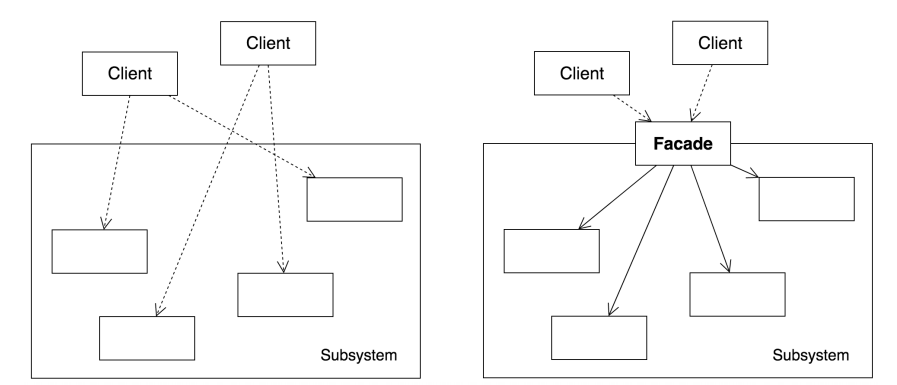
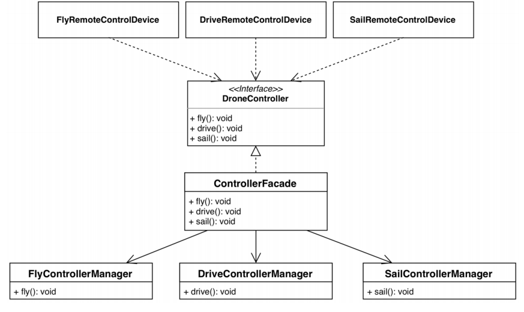

* 각각의 매니저가 단일 책임과 인터페이스 분리 원칙을 지키고 있고, 이 것의 사용을 쉽게 하기 위해서 클라이언트에게 상위 수준의 인터페이스인 DroneController를 제공하고 있다.
* 허나 이는 DroneController가 다시 단일 책임 원칙을 위반하는 실수를 저지르고 말았다.
* 또한 DroneController는 인터페이스 분리 원칙을 위반하고 있다.

따라서 DroneController에서 fly, drive, sail 메소드를 **그대로 제공할 것이 아니라** 사용 목적에 맞게 주제를 정하여 제공해야한다.  
만약 퍼사드 패턴을 통해서 DroneController가 **드론이 할 수 있는 모든 것**을 작은 단위별로 제공할 것이 아니라, **조작**을 위한 인터페이스 형태로 제공한다면?  
DroneController 은 "드론 조작"이라는 단일 책임 원칙을 지키면서 "드론 조작"에 필요한 메소드만 사용할 수 있게 "강제"할 수 있다.

[다음](../five/README.md)을 보자