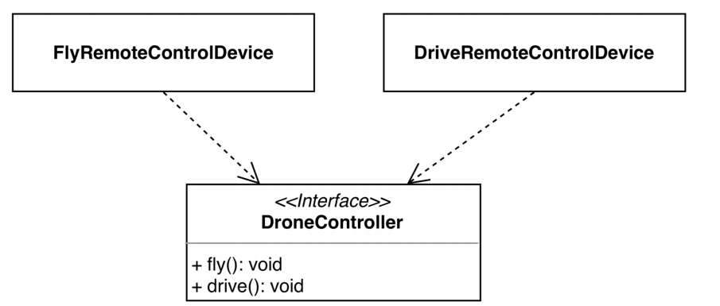

* 클라이언트가 DriveRemoteController의 의존성으로 DroneController를 주입받았다.
* 그리고 DroneController가 제공하는 메소드인 drive에 접근이 가능하다.
* 허나, 클라이언트는 오직 drive를 하기 위해 DriveRemoteControllerDevice를 만들었는데 쓸모 없는 fly 메소드까지 접근이 가능하다.

따라서 이는 잘못 되었다. 단일 책임 원칙과 인터페이스 분리 원칙을 모두 어겼다.