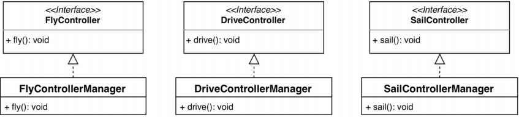

* 위 그림을 보면 각각의 매니저가 따로 있고 이것을 클라이언트가 주입받아서 사용한다.
* 따라서 **단일 책임 원칙**과 **인터페이스 분리 원칙**을 모두 지켰다.
* 허나 이는 문제점이 있는데, 인터페이스가 너무 많기 때문에 사용자가 사용하기에는 너무나도 어렵다는 것이다.
* 그래서 시스템 설계자는 각각의 인터페이스를 상황에 맞게 사용할 수 있도록 더 상위 수준의 인터페이스를 제공한다.
* 그것을 파사드 디자인 패턴이라고 부른다.

[다음](../four/README.md)을 보자