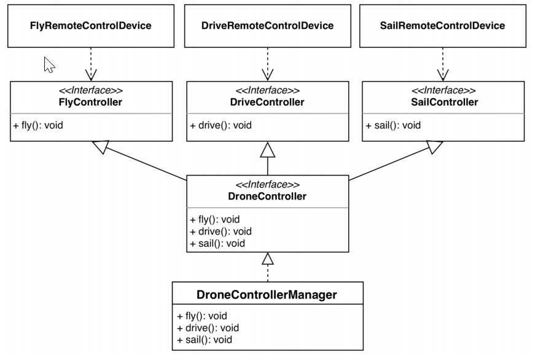

아래는 클라이언트가 만든 FlyRemoteControllerDevice 를 실행하는 코드의 일부이다.
```java
// 드론 컨트롤러를 생성한다.
DronController dronController = new DronControllerManager();

// 컨트롤러를 주입받는다.
FlyRemoteControllerDevice controller = new FlyRemoteControllerDevice(dronController);
// FlyRemoteControllerDevice 는 fly, drive, sail에 모두 접근이 가능한 구현체를 주입했기에 
// 클라이언트는 세 메소드 모두에 접근이 가능하다.
```

* 그림을 보면 각각의 컨트롤러는 단일 책임과 인터페이스 분리 원칙을 지키기 위해서 메소드를 분개했다.
* 세가지 인터페이스를 통해서만 각각 클라이언트가 접근이 가능하게 되어서 인터페이스 분리 원칙을 지켰다.(사용자에게 불필요한 메소드는 가렸다.)
* 그리고 DroneController 구현체인 DroneControllerManager는 FlyController 인터페이스로 받아서 호출이 가능한데, 이때는 오직 FlyController의 fly 메소드만 호출이 가능하기 때문

허나 이는 단일 책임 원칙을 위배한다. DroneController 가 세가지 책임을 지고 있기 때문이다.  
따라서 [다음](../three/README.md)과 같이 더 작은 컨트롤러로 나누어야 한다.

